# FingerPay 💳🖐️

**Biometric Fingerprint Payment System** — a full-stack mobile payment platform that lets customers pay using their fingerprint instead of cash, cards, or phones. Built with React Native (Expo), Node.js/Express, MongoDB, and an AS608 optical fingerprint sensor driven by a Python service.

---

## 📸 Screenshots

<div align="center">
  <table>
    <tr>
      <td>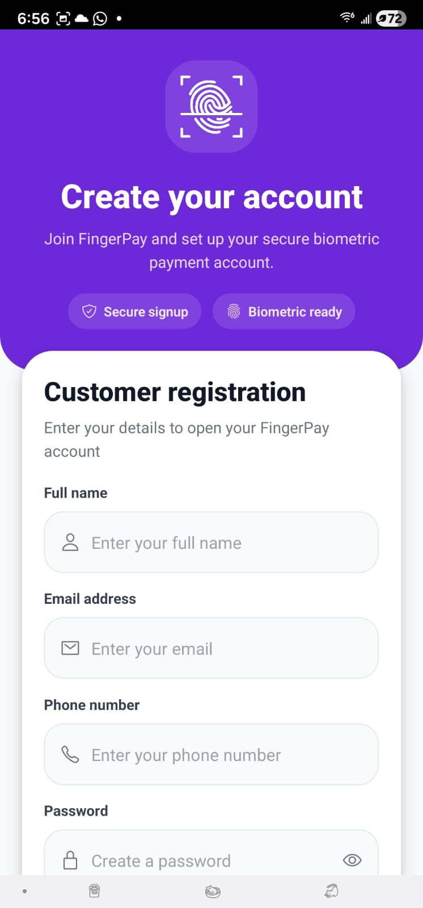</td>
      <td>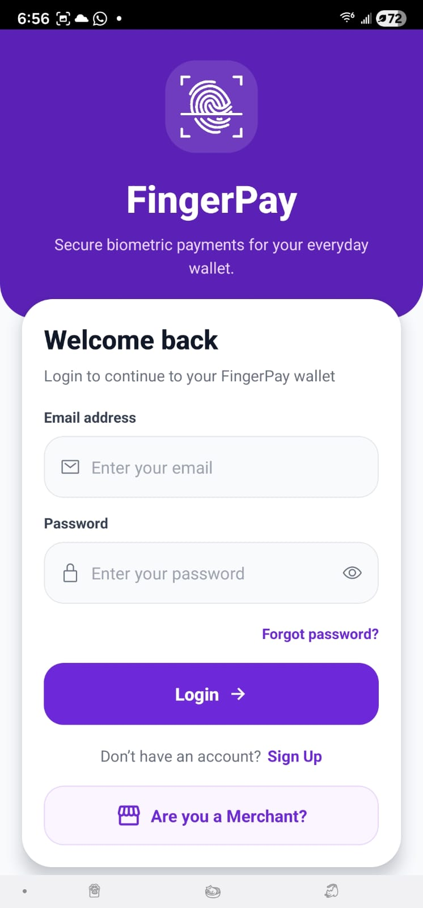</td>
      <td>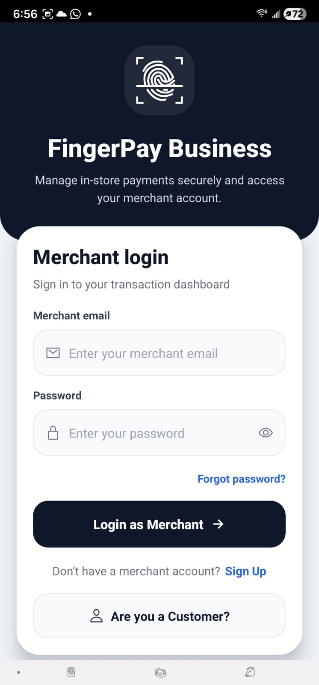</td>
      <td>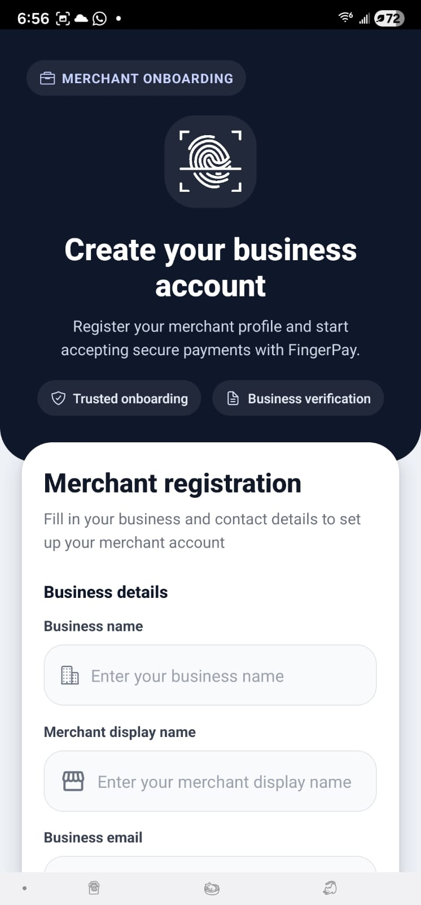</td>
    </tr>
    <tr>
      <td align="center">Customer Sign Up</td>
      <td align="center">Customer Login</td>
      <td align="center">Merchant Login</td>
      <td align="center">Merchant Sign Up</td>
    </tr>
    <tr>
      <td>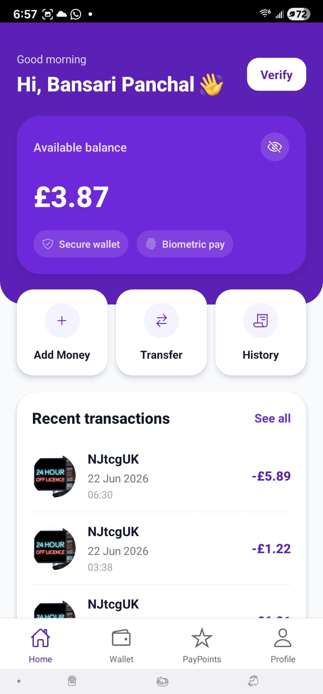</td>
      <td>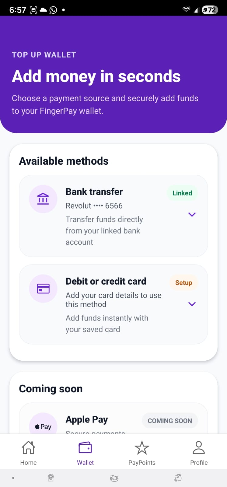</td>
      <td>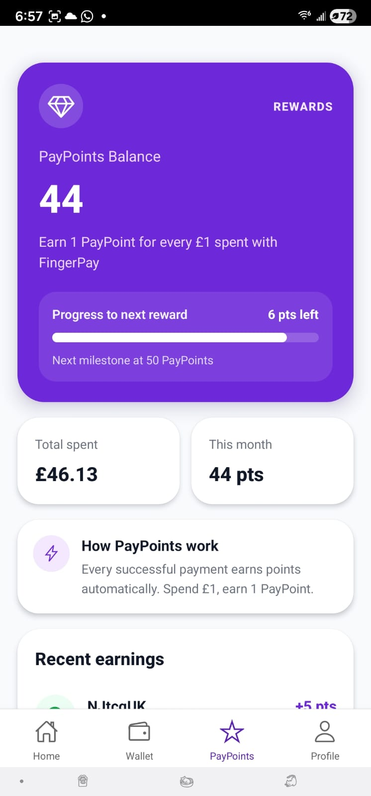</td>
      <td>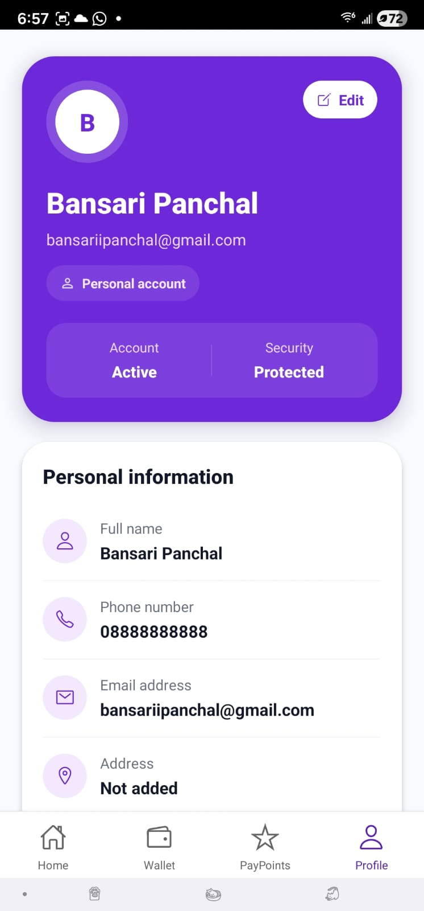</td>
    </tr>
    <tr>
      <td align="center">Customer Home</td>
      <td align="center">Wallet</td>
      <td align="center">Pay Points</td>
      <td align="center">Profile</td>
    </tr>
    <tr>
      <td>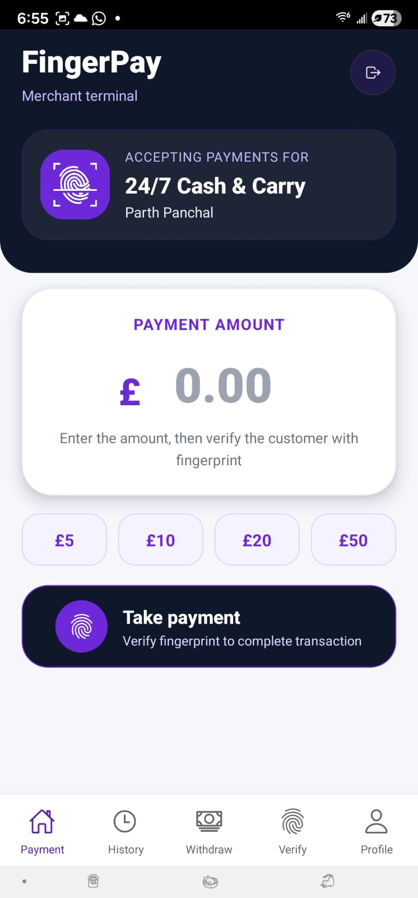</td>
      <td>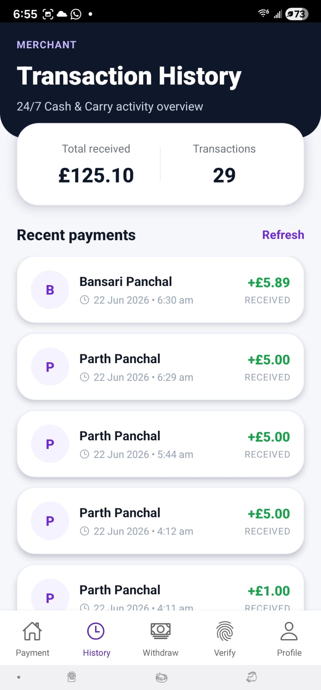</td>
      <td>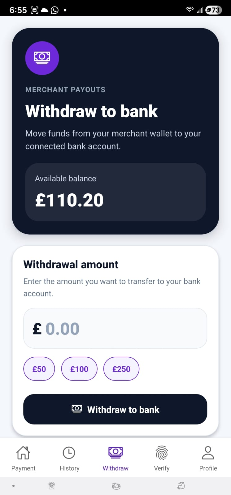</td>
      <td>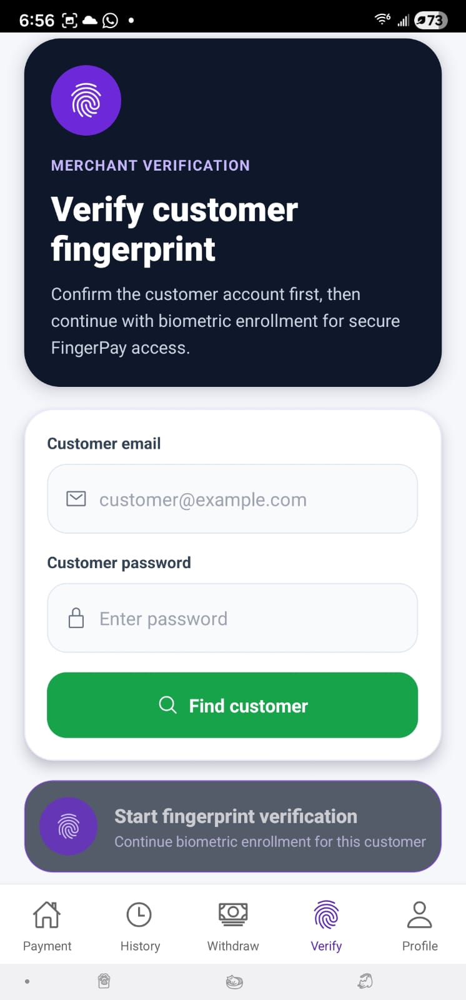</td>
    </tr>
    <tr>
      <td align="center">Merchant Terminal</td>
      <td align="center">Transaction History</td>
      <td align="center">Withdraw</td>
      <td align="center">Fingerprint Verify</td>
    </tr>
  </table>
</div>

---

## 🏗️ Architecture

FingerPay follows a **three-tier architecture**:

```
┌─────────────────────────────────────────────────────────────────┐
│                    React Native / Expo App                       │
│              (Customer & Merchant Interfaces)                    │
├─────────────────────────────────────────────────────────────────┤
│                    Node.js / Express API                         │
│         (REST — Auth, Users, Merchants, Payments, etc.)          │
├──────────────────────────┬──────────────────────────────────────┤
│        MongoDB           │        Python Flask API              │
│   (Users, Merchants,     │   (AS608 Sensor Control —            │
│    Transactions, etc.)   │    Enrol, Match, Delete)             │
└──────────────────────────┴──────────────────────────────────────┘
                               │
                    ┌──────────┴──────────┐
                    │   AS608 Fingerprint  │
                    │   Sensor (USB/UART)  │
                    └─────────────────────┘
```

### Components

| Layer | Technology | Location |
|-------|-----------|----------|
| **Mobile App** | React Native (Expo SDK 49) | `frontend/` |
| **Backend API** | Node.js + Express | `backend/` |
| **Database** | MongoDB (Mongoose ODM) | `backend/` config |
| **Fingerprint Service** | Python 3 + Flask + PySerial | `AS608/` |

---

## ✨ Features

### 👤 Customer
- **Sign Up / Login** with email & password
- **Email verification** via OTP code (6-digit, 10-minute expiry)
- **Dashboard** — view balance (toggleable), recent transactions, greetings
- **Wallet** — top up funds via card or bank transfer
- **Pay Points** — find nearby merchants to pay
- **Biometric payments** — pay at any merchant terminal using your fingerprint
- **Transaction history** — full list of past payments with merchant details
- **Profile management**

### 🏪 Merchant
- **Separate merchant registration** (company name, VAT number, license number, etc.)
- **Payment terminal** — enter amount, verify customer fingerprint, process transaction
- **Quick amount presets** — £5, £10, £20, £50
- **Transaction history** — see all customer payments with customer details
- **Withdraw funds** — move earnings from merchant wallet
- **Fingerprint verification** — verify customer identity independently
- **Profile page** with business details

### 🔬 Biometric (AS608 Sensor)
- **Fingerprint enrolment** — capture finger twice, generate template, store in MongoDB + sensor flash
- **Fingerprint matching** — compare live scan against all enrolled templates in DB
- **Sensor health check** — diagnostic endpoint
- **Delete all templates** — clear sensor flash
- **Raw image capture** — optional display of scanned fingerprint image

---

## 🚀 Getting Started

### Prerequisites

- **Node.js** >= 18
- **Python** >= 3.9
- **MongoDB** (local or Atlas)
- **AS608 Fingerprint Sensor** (USB, CP210x / Silicon Labs UART bridge)
- **Expo CLI** (`npm install -g expo-cli`)
- **Android/iOS device** or emulator

### 1. Clone & Install

```bash
# Backend
cd backend
npm install

# Frontend
cd ../frontend
npm install

# Python fingerprint service
cd ../AS608
pip install -r requirements.txt
pip install -e .           # install the 'fingerprint' package
```

### 2. Configure Environment

**Backend** (`backend/.env`):
```env
PORT=5000
MONGODB_URI=mongodb://localhost:27017/fingerpay
JWT_SECRET=your-secret-key-here
EMAIL_USER=your-email@gmail.com
EMAIL_PASS=your-app-password
```

**Frontend** (`frontend/src/config/env.js`):
```js
export const API_BASE_URL = 'http://<your-local-ip>:5000/api';
```

### 3. Run the Stack

**Terminal 1 — Backend:**
```bash
cd backend
npm run dev        # nodemon, runs on :5000
```

**Terminal 2 — Python Fingerprint Service:**
```bash
cd AS608
python app.py      # Flask, runs on :5001
```

**Terminal 3 — Mobile App:**
```bash
cd frontend
npx expo start     # Scan QR with Expo Go app
```

---

## 📁 Project Structure

```
fingerpay/
├── AS608/                          # Python fingerprint sensor service
│   ├── fingerprint/                #   Low-level AS608 driver library
│   │   ├── __init__.py
│   │   ├── lib.py                  #   Serial protocol implementation
│   │   └── utils.py                #   Utility functions
│   ├── app.py                      #   Flask REST API (enrol/match/delete/health)
│   ├── enrol.py                    #   CLI — enrol fingerprint to sensor
│   ├── enroll_mongo.py             #   CLI — enrol + store template in MongoDB
│   ├── match_mongo.py              #   CLI — match against DB templates
│   ├── delete.py                   #   CLI — delete from sensor flash
│   ├── requirements.txt
│   ├── setup.py
│   └── manual.pdf                  # AS608 datasheet
│
├── backend/                        # Node.js + Express REST API
│   ├── src/
│   │   ├── server.js               #   Entry point — starts Express + MongoDB
│   │   ├── app.js                  #   Express app with route mounting
│   │   ├── config/
│   │   │   ├── db.js               #   MongoDB connection config
│   │   │   └── env.js              #   Environment variable loader
│   │   ├── models/
│   │   │   ├── User.js             #   Customer schema (balance, card, bank, biometric)
│   │   │   ├── Merchant.js         #   Merchant schema (company, VAT, license, balance)
│   │   │   ├── Transaction.js      #   Transaction record (user↔merchant, amount)
│   │   │   ├── Biometric.js        #   Biometric link reference
│   │   │   ├── EmailCode.js        #   OTP storage for email verification
│   │   │   └── AuditLog.js         #   Audit trail
│   │   ├── controllers/
│   │   │   ├── authController.js   #   Email OTP send & verify
│   │   │   ├── userController.js   #   CRUD, login, balance
│   │   │   ├── merchantController.js # Register, login, transactions, withdraw
│   │   │   ├── paymentController.js  # Process biometric & standard payments
│   │   │   ├── biometricController.js # Proxy to Python sensor service
│   │   │   ├── transactionController.js # Charge customer, process tx
│   │   │   ├── bankController.js   #   Bank transfer operations
│   │   │   └── cardController.js   #   Card top-up operations
│   │   ├── routes/
│   │   │   ├── userRoutes.js
│   │   │   ├── merchantRoutes.js
│   │   │   ├── paymentRoutes.js
│   │   │   ├── biometricRoute.js
│   │   │   ├── authRoutes.js
│   │   │   └── bankRoutes.js
│   │   ├── middleware/
│   │   │   ├── authMiddleware.js   #   JWT verification
│   │   │   ├── merchantAuth.js     #   Merchant-specific JWT
│   │   │   ├── errorHandler.js     #   Global error handler
│   │   │   └── validateRequest.js  #   Request validation
│   │   ├── services/
│   │   │   ├── biometricService.js #   Python API client
│   │   │   ├── paymentService.js   #   Payment logic
│   │   │   └── loggingService.js   #   Audit logging
│   │   └── utils/
│   │       ├── constants.js
│   │       └── responseFormatter.js
│   ├── package.json
│   └── .env
│
├── frontend/                       # React Native (Expo) mobile app
│   ├── App.js                      #   Entry point
│   ├── src/
│   │   ├── App.jsx                 #   Root component with providers
│   │   ├── config/
│   │   │   └── env.js              #   API base URL
│   │   ├── context/
│   │   │   └── AuthContext.jsx     #   Auth state (login/logout/token/role)
│   │   ├── navigation/
│   │   │   └── AppNavigator.jsx    #   Stack + Tab navigation
│   │   ├── screens/
│   │   │   ├── SplashScreen.jsx    #   Animated splash
│   │   │   ├── LoginScreen.jsx     #   Customer login
│   │   │   ├── SignUpScreen.jsx    #   Customer registration
│   │   │   ├── HomeScreen.jsx      #   Customer dashboard
│   │   │   ├── MoneyScreen.jsx     #   Wallet — add funds
│   │   │   ├── PayPointsScreen.jsx #   Find merchants
│   │   │   ├── VerifyAccountScreen.jsx # Email OTP verification
│   │   │   ├── CardDetailsScreen.jsx   # Card top-up form
│   │   │   ├── BankDetailsScreen.jsx   # Bank transfer form
│   │   │   ├── EnrolmentScreen.jsx     # Fingerprint enrolment
│   │   │   ├── VerifyFingerPrintScreen.jsx # Fingerprint verification
│   │   │   ├── PaymentScreen.jsx       # Merchant terminal UI
│   │   │   ├── HistoryScreen.jsx       # Merchant transaction history
│   │   │   ├── WithdrawScreen.jsx      # Merchant withdrawal
│   │   │   ├── ProfileScreen.jsx       # User/merchant profile
│   │   │   ├── FingerprintSuccessScreen.jsx # Post-verify success
│   │   │   └── PaymentResultScreen.jsx # Payment result
│   │   ├── components/
│   │   │   ├── BottomNavBar.jsx   #   Customer bottom tabs
│   │   │   ├── MerchantTabs.jsx   #   Merchant bottom tabs
│   │   │   ├── AmountInput.jsx
│   │   │   ├── PrimaryButton.jsx
│   │   │   └── TransactionSummary.jsx
│   │   ├── services/
│   │   │   ├── api.js             #   Axios API client
│   │   │   ├── biometricService.js#   Biometric API calls
│   │   │   └── storageService.js  #   AsyncStorage helpers
│   │   └── utils/
│   │       ├── formatCurrency.js
│   │       └── validation.js
│   ├── app.json
│   └── package.json
│
└── Screenshots/                    # App screenshots for README
```

---

## 🔌 API Endpoints

### Authentication
| Method | Endpoint | Description |
|--------|----------|-------------|
| POST | `/api/user/login` | Customer login |
| POST | `/api/user/register` | Customer registration |
| POST | `/api/merchant/login` | Merchant login |
| POST | `/api/merchant/register` | Merchant registration |
| POST | `/api/auth/send-code` | Send email OTP |
| POST | `/api/auth/verify-code` | Verify email OTP |

### User
| Method | Endpoint | Description |
|--------|----------|-------------|
| GET | `/api/user/me` | Get current user profile |
| GET | `/api/user/transactions` | Get user transactions |
| GET | `/api/user/:id` | Get user by ID |
| POST | `/api/user/verify-credentials` | Verify email + password |

### Merchant
| Method | Endpoint | Description |
|--------|----------|-------------|
| GET | `/api/merchant/me` | Get merchant profile |
| GET | `/api/merchant/transactions` | Get merchant transaction history |
| POST | `/api/merchant/withdraw` | Withdraw wallet funds |

### Payments
| Method | Endpoint | Description |
|--------|----------|-------------|
| POST | `/api/payments/pay-with-biometric` | Pay using biometric ID |
| POST | `/api/payments/pay` | Pay with default method |
| POST | `/api/transactions/pay` | Merchant charges customer (auth) |
| POST | `/api/transactions/process` | Process payment transaction |

### Biometric (Fingerprint)
| Method | Endpoint | Description |
|--------|----------|-------------|
| POST | `/api/biometric/enroll` | Enrol fingerprint (proxies to Python) |
| POST | `/api/biometric/verify` | Verify fingerprint (proxies to Python) |

### Python Sensor Service (port 5001)
| Method | Endpoint | Description |
|--------|----------|-------------|
| POST | `/enroll` | Capture finger twice, store template |
| POST | `/match` | Match fresh finger against DB templates |
| POST | `/delete` | Delete all templates from sensor flash |
| GET | `/health` | Sensor connectivity check |

### Banking & Cards
| Method | Endpoint | Description |
|--------|----------|-------------|
| GET | `/api/bank/users` | List bank users |
| GET | `/api/bank/users/:id` | Get bank user by ID |

---

## 🔐 How Fingerprint Matching Works

1. **Enrolment**: User places finger twice → AS608 sensor captures two images → features are extracted into internal buffers → a combined 512‑byte template is generated → stored in MongoDB (`fingerpay.biometrics`) and optionally on the sensor's onboard flash.

2. **Matching**: User places finger once → sensor captures image and extracts features into Buffer 2 → system loops through every stored template in MongoDB → each template is written to Buffer 1 → sensor's hardware compares Buffer 1 vs Buffer 2 → if score exceeds threshold, match is confirmed → associated user is returned.

3. **Security**: All biometric template data stays in MongoDB. The Node.js backend never handles raw template bytes — it proxies through the Python Flask service which communicates directly with the sensor over USB/UART.

---

## 🧪 Running Individual Scripts

The `AS608/` directory includes standalone CLI scripts for testing the sensor independently of the web app:

```bash
# Enrol a fingerprint (sensor-only, no DB)
python AS608/enrol.py

# Enrol + store template in MongoDB
python AS608/enroll_mongo.py

# Match against templates in MongoDB
python AS608/match_mongo.py

# Delete all templates from sensor flash
python AS608/delete.py
```

---

## 🛠️ Tech Stack

| Category | Technology |
|----------|-----------|
| **Frontend** | React Native 0.72, Expo 49, React Navigation 6 |
| **Backend** | Node.js, Express 4, Mongoose 8, JWT, bcryptjs |
| **Database** | MongoDB |
| **Biometric** | AS608 optical sensor, Python 3, Flask, PySerial |
| **Email** | Nodemailer (Gmail SMTP) |
| **HTTP Client** | Axios |

---

## 🤝 Contributing

This is a personal project. Feel free to fork, open issues, or submit pull requests.

---

## ⚠️ Notes

- The `.env` file contains placeholder credentials — **do not use them in production**.
- The JWT secret and email app password should be rotated and stored securely.
- The Python fingerprint service (`app.py`) must be running on the same machine as the AS608 sensor (USB‑connected).
- The mobile app connects to the backend over your local network — ensure the backend IP is correctly set in `frontend/src/config/env.js`.
